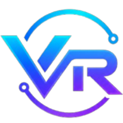

<p align="center">
  
</p>

<p align="center">
  
</p>

<h2 align="center">Visual AI pipeline workflow builder</h2>

---

<p align="center">


</p>

---

# Vectirix

> *Drag, drop, and build AI workflows.*
> **Vectirix** is a visual AI pipeline builder where users construct data processing workflows by dragging and connecting nodes on an interactive canvas.
> Built with **React 18**, **ReactFlow**, **Zustand**, and **Vercel Python Serverless Functions** for speed, modularity, and real-time graph analysis.

---

# ✨ Features

- 🧩 **9 Node Types** — Input, Output, LLM, Text, API, Database, Condition, Transform, Notification
- 🔗 **Draggable Edges** — Interactive edge routing with adjustable midpoint handles
- 🌓 **Dark / Light Theme** — Persistent theme toggle with smooth CSS transitions
- 🔤 **Variable Interpolation** — Text nodes auto-detect `{{variable}}` syntax and generate dynamic handles
- 📊 **Pipeline Analysis** — Submit pipelines for DAG validation, cycle detection, entry/exit nodes, and graph metrics
- ⏪ **Undo/Redo** — Full history with Ctrl+Z / Ctrl+Y
- ⌨️ **Keyboard Shortcuts** — Delete, duplicate (Ctrl+D), select all (Ctrl+A)
- 💾 **Auto-Save** — Pipeline persists to localStorage every few seconds, restored on load
- 📦 **Export/Import** — Download pipeline as JSON, upload JSON to restore
- 📋 **Pipeline Templates** — 7 pre-built templates (Chatbot, RAG, Summarizer, Translator, etc.)
- 🧹 **Playground Controls** — One-click clear with confirmation dialog

---

# 💡 Why This Project?

This project demonstrates a visual programming paradigm for AI pipelines: **how to make complex workflow construction intuitive through a drag-and-drop node editor.**

- **Problem**: Building AI pipelines typically requires writing code or configuring YAML — not accessible to non-developers.
- **Solution**: A ReactFlow-powered canvas with typed nodes, custom edges, and real-time graph validation.
- **Why it matters**: Lowers the barrier to designing data processing workflows. Enables rapid prototyping and visual debugging.
- **Who it helps**: AI/ML engineers, data pipeline designers, no-code workflow builders, and students learning pipeline architectures.

---

# 🧩 Tech Stack

| Layer          | Technology                               |
| -------------- | ---------------------------------------- |
| Frontend       | Create React App (React 18 / JavaScript) |
| Canvas         | ReactFlow 11 (node-based graph editor)   |
| State          | Zustand (lightweight state management)   |
| Backend        | Vercel Python Serverless Functions       |
| Styling        | Vanilla CSS with custom properties       |
| Graph Analysis | DFS-based cycle detection                |
| Deployment     | Vercel                                   |

---

# 📂 Project Structure

```plaintext
vectirix/
├── api/
│   ├── analyze.py                   # POST /api/analyze - pipeline graph analysis
│   └── health.py                    # GET /api/health - health check
├── frontend/
│   ├── public/
│   │   ├── index.html               # HTML entry point
│   │   ├── Vectirix_Brand.png       # Brand logo
│   │   └── Vectirix_logo.png        # App icon / favicon
│   ├── src/
│   │   ├── api.js                   # API client with timeout & error handling
│   │   ├── App.js                   # Main shell (header, toolbar, canvas)
│   │   ├── store.js                 # Zustand state (nodes, edges, undo/redo, localStorage)
│   │   ├── ui.js                    # ReactFlow canvas setup (MiniMap, Controls, Grid, Snap)
│   │   ├── toolbar.js               # Node palette / draggable chips
│   │   ├── draggableNode.js         # Individual draggable chip component
│   │   ├── submit.js                # Submit analysis & clear playground
│   │   ├── index.js                 # App entry point
│   │   ├── index.css                # Global styles & theme variables
│   │   ├── hooks/
│   │   │   └── useKeyboardShortcuts.js  # Keyboard shortcut handler
│   │   ├── components/
│   │   │   ├── ExportImport.js      # Export/Import pipeline JSON
│   │   │   ├── Templates.js         # Pipeline template selector
│   │   │   └── Notification.js     # Toast notification system
│   │   └── nodes/
│   │       ├── BaseNode.js          # Reusable node wrapper (icon, header, handles, resizer, tooltip)
│   │       ├── BaseNode.css         # Node & handle styling
│   │       ├── DraggableEdge.js     # Custom edge with adjustable midpoint + delete button
│   │       ├── inputNode.js         # Source node (Text / File)
│   │       ├── outputNode.js        # Sink node (Text / Image)
│   │       ├── llmNode.js           # LLM invocation node
│   │       ├── textNode.js          # Text with {{variable}} interpolation + dynamic handles
│   │       ├── apiNode.js           # HTTP request node
│   │       ├── dbNode.js            # Database operation node
│   │       ├── conditionNode.js     # If / then / else branch node
│   │       ├── transformNode.js     # Code transform (JS / Python)
│   │       └── notificationNode.js  # Alert dispatch node
│   └── package.json
├── vercel.json                      # Vercel deployment config
├── requirements.txt                 # Python dependencies
└── README.md
```

---

# ⚙️ Installation

```bash
# Clone the repository
git clone https://github.com/Cipher-Shadow-IR/Vectirix.git

# Enter the project directory
cd Vectirix/vectirix/frontend

# Install dependencies
npm install
```

---

# ▶️ Run Locally

```bash
# Start the frontend dev server (from frontend/)
npm start
```

Open [http://localhost:3000](http://localhost:3000) in your browser to start building pipelines.

To test API functions locally with Vercel CLI:

```bash
npm install -g vercel
vercel dev
```

---

# 🔐 Environment Variables

No environment variables are required. All API calls use relative `/api` paths, which work identically in local development and production on Vercel.

---

# 🧠 How It Works

1. **User opens** the canvas and drags nodes from the toolbar onto the ReactFlow workspace.
2. **User configures** each node via its inline form (e.g., sets LLM prompt, API URL, text content with `{{variable}}` placeholders).
3. **User connects** nodes by dragging edges from source handles to target handles — edges auto-route with an adjustable midpoint.
4. **User submits** the pipeline via the "Analyze Pipeline" button, which POSTs the graph to the API.
5. **Backend analyzes** the graph: counts nodes and edges, performs DFS cycle detection, identifies entry/exit/disconnected/orphan nodes.
6. **Results display** in a modal — the user can then iterate, modify, or clear the playground.

---

# 🚀 Roadmap

- [ ] Save / load pipeline configurations to local storage
- [ ] Undo / redo support for canvas operations
- [ ] Export pipeline as JSON / YAML
- [ ] Custom node SDK for third-party integrations
- [ ] Real-time pipeline execution with streaming outputs

---

# 🧪 Testing

```bash
# Run the React test suite
cd frontend
npm test
```

For manual API testing:

```bash
# Pipeline health check
curl https://your-app.vercel.app/api/health

# Analyze a pipeline
curl -X POST https://your-app.vercel.app/api/analyze \
  -H "Content-Type: application/json" \
  -d '{"nodes":[{"id":"1","type":"customInput"},{"id":"2","type":"llm"}],"edges":[{"source":"1","target":"2"}]}'
```

---

# 🚀 Deployment

The entire application deploys to Vercel with a single connection.

1. Push the repository to GitHub
2. Import the project in Vercel
3. Set the root directory to `vectirix/`
4. Deploy

No external backend hosting required. No Render. No Railway.

---

# 📈 Future Improvements

- Custom node plugin system
- Pipeline execution engine (run pipelines end-to-end)
- Node grouping / sub-pipeline support
- Collaborative editing with WebSocket sync
- Integration with real LLM providers (OpenAI, Anthropic, etc.)

---

# 📜 License

Apache-2.0 License

---

## 💬 Author

<p align="center">
  <br><br>
  <b>Built by Ishaan Ray (Cipher Shadow IR)</b><br>
  <i>"Building Visual Workflow Systems!"</i><br><br>
  <a href="https://github.com/Cipher-Shadow-IR" target="_blank">
    
  </a>
</p>

---

# ⭐ Support

If you liked this project:

```md
Give it a star ⭐
```
